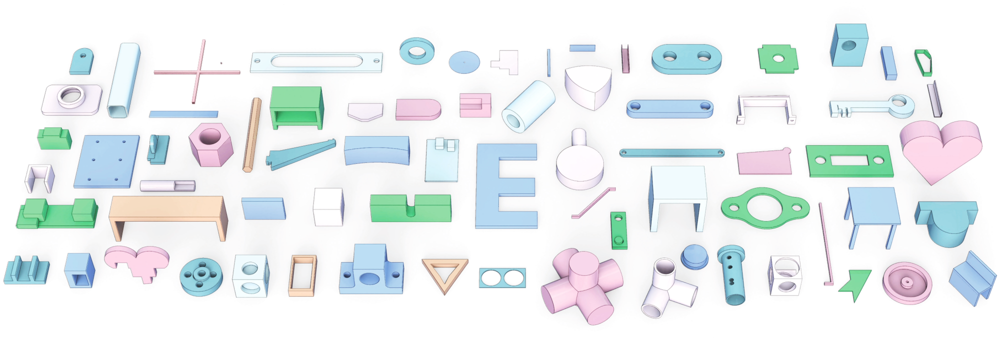
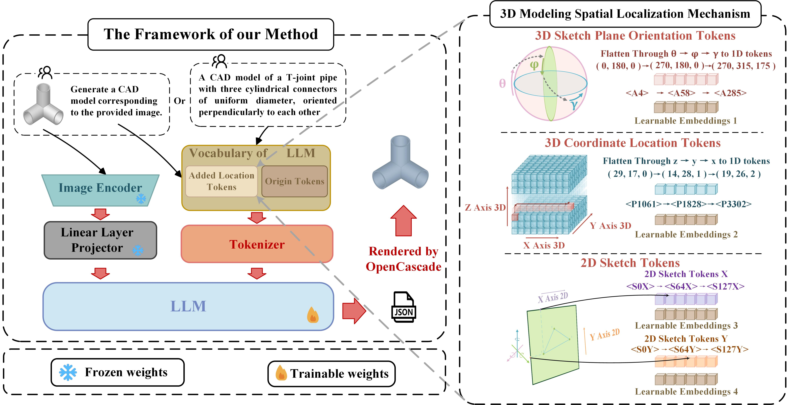

<div align= "center">
    <h1>[AAAI 2025 Paper] Official Repo for CAD-GPT</h1>

</div>

<div align="center">
    <h2> <a href="https://ojs.aaai.org/index.php/AAAI/article/view/32849">CAD-GPT: Synthesising CAD Construction Sequence with Spatial Reasoning-Enhanced Multimodal LLMs</a></h2>

<p align="center">
  <a href="https://openiwin.github.io/CAD-GPT/">Project Page</a> •
  <a href="https://arxiv.org/abs/2412.19663">Arxiv Paper</a> •
  <a href="#-citation">Citation
</p>

</div>


## 🏃 Intro CAD-GPT

**CAD-GPT** is the pioneering multimodal large language model designed to process a **single image or textual description** as input, specifically for the precise synthesis of CAD modeling sequences




## 🚩 News
- [2025/06/13] We will release part of the dataset and the corresponding processing code in the near future.
- [2025/06/13] Upload the Demo videos for CAD-GPT on the project page.
- [2024/12/27] Upload paper and init project.


## ⚡ Demo for Watching


## 📖 Citation

If you find our paper helps, please consider citing:

```bibtex
@inproceedings{wang2025cad,
            title={CAD-GPT: Synthesising CAD Construction Sequence with Spatial Reasoning-Enhanced Multimodal LLMs},
            author={Wang, Siyu and Chen, Cailian and Le, Xinyi and Xu, Qimin and Xu, Lei and Zhang, Yanzhou and Yang, Jie},
            booktitle={Proceedings of the AAAI Conference on Artificial Intelligence},
            volume={39},
            number={8},
            pages={7880--7888},
            year={2025}
          }
```

